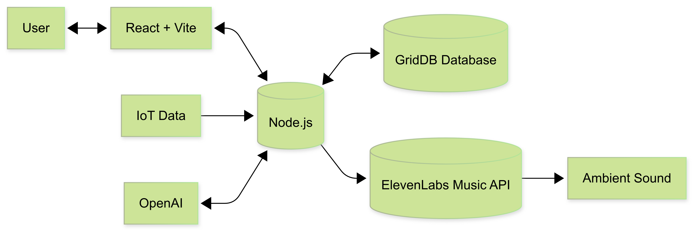

# Create Dynamic Ambient Music Using AI and IoT Data


This tutorial shows how to generate evolving ambient music driven by IoT sensor data. We’ll ingest sensor readings into **GridDB** database, map those readings to musical parameters using OpenAI, and call **ElevenLabs Music** to render an audio track. The UI is built with **React + Vite**, and the backend is **Node.js**.

## Introduction

Ambient music thrives on context. Here, the environment literally composes the score. Heat can slow the tempo, humidity can soften the timbre, and human presence can thicken the arrangement. We’ll stitch together a small system: devices post telemetry (we will use the data directly), GridDB keeps the data, the AI model creates music parameters, and ElevenLabs will render audio that you can play instantly in the browser.

## System Architecture




The system has several core components working together to turn IoT data into ambient sound:

**IoT Data Source**

Environmental sensors capture values such as temperature, humidity, sound levels, and occupancy. These readings are the raw input for the music generation process.

**Node.js Backend**

Node.js acts as the central orchestrator. It receives IoT sensor readings and coordinates interactions between the AI models, the music generator, and the database.

**OpenAI Model**

The IoT data is processed by an OpenAI model. The model transforms the data into a musical prompt. For example, “calm ambient soundscape with airy textures and slow tempo.” This ensures the music reflects the current environment in a more human-like, descriptive way.

**ElevenLabs Music API**

The generated music prompt is sent to the ElevenLabs Music API. ElevenLabs then produces an audio track that matches the description. The result is ambient audio that adapts to real-world conditions.

**GridDB Database**

Both the music prompt and the audio metadata (such as file path or data URL) are stored in GridDB. GridDB also keeps the original IoT readings.

**React + Vite Frontend**

The frontend provides a web-based interface where users can trigger new music generation, view sensor snapshots, and play the most recent ambient tracks.


## Prerequisites

### Node.js

This project is built using React + Vite, which requires Node.js version 16 or higher. You can download and install Node.js from [https://nodejs.org/en](https://nodejs.org/en).


### OpenAI

Create the OpenAI API key [here](https://platform.openai.com/). You may need to create a project and enable a few models.


In this project, we will use an AI model from OpenAI:

- `gpt-5-mini` to create an audio prompt.

### GridDB

#### Sign Up for GridDB Cloud Free Plan

If you would like to sign up for a GridDB Cloud Free instance, you can do so at the following link: [https://form.ict-toshiba.jp/download_form_griddb_cloud_freeplan_e](https://form.ict-toshiba.jp/download_form_griddb_cloud_freeplan_e).

After successfully signing up, you will receive a free instance along with the necessary details to access the GridDB Cloud Management GUI, including the **GridDB Cloud Portal URL**, **Contract ID**, **Login**, and **Password**.

#### GridDB WebAPI URL

Go to the GridDB Cloud Portal and copy the WebAPI URL from the **Clusters** section. It should look like this:


#### GridDB Username and Password

Go to the **GridDB Users** section of the GridDB Cloud portal and create or copy the username for `GRIDDB_USERNAME`. The password is set when the user is created for the first time. Use this as the `GRIDDB_PASSWORD`.


For more details, to get started with GridDB Cloud, please follow this [quick start guide](https://griddb.net/en/blog/griddb-cloud-quick-start-guide/).

#### IP Whitelist

When running this project, please ensure that the IP address where the project is running is whitelisted. Failure to do so will result in a 403 status code or forbidden access.

You can use a website like [What Is My IP Address](https://whatismyipaddress.com/) to find your public IP address.

To whitelist the IP, go to the GridDB Cloud Admin and navigate to the **Network Access** menu.


### ElevenLabs

You need an ElevenLabs account and API key to use this project. You can sign up for an account at [https://elevenlabs.io/signup](https://elevenlabs.io/signup).

After signing up, go to the [**Developer**](https://elevenlabs.io/app/developers/api-keys) section, and create and copy your API key.


And make sure to enable the **Music Generation** access permission.


## How to Run

### 1. Clone the repository

Clone the repository from [https://github.com/junwatu/grid-sound-ambient](https://github.com/junwatu/grid-sound-ambient) to your local machine.

```sh
git clone https://github.com/junwatu/grid-sound-ambient.git
cd grid-sound-ambient
cd apps
```

### 2. Install dependencies

Install all project dependencies using npm.

```sh
npm install
```

### 3. Set up environment variables

Copy file `.env.example` to `.env` and fill in the values:

```ini
# Copy this file to .env.local and add your actual API keys
# Never commit .env.local to version control

# ElevenLabs API Key for ElevenLabs Music
ELEVENLABS_API_KEY=

OPENAI_API_KEY=

GRIDDB_WEBAPI_URL=
GRIDDB_PASSWORD=
GRIDDB_USERNAME=

WEB_URL=http://localhost:3000
```

Please look at the section on [Prerequisites](#prerequisites) before running the project.

### 4. Run the project

Run the project using the following command:

```sh
npm run start
```

### 5. Open the application

Open the application in your browser at [http://localhost:3000](http://localhost:3000) or any address that `WEB_URL` is set to. You also need to allow the browser to access your microphone.


## Building The Ambient Music Generator


### IoT Data

In this project, we will use pre-made IoT data. The data is an array of sensor snapshots. Each object is a single time-stamped reading for a building zone. This data mimics real data conditions from the IoT sensor.

```json
[
  {
    "timestamp": "2025-08-20T09:15:00",
    "zone": "Meeting Room A",
    "temperature_c": 22.8,
    "humidity_pct": 47,
    "co2_ppm": 1020,
    "voc_index": 185,
    "occupancy": 7,
    "noise_dba": 49,
    "productivity_score": 65,
    "trend_10min.co2_ppm_delta": 120,
    "trend_10min.noise_dba_delta": 1,
    "trend_10min.productivity_delta": -5
  },
  ...
]
```

You can look at the data sample in the `apps/data/iot_music_samples.json`.

## User Interface

The UI is a small React app (Vite + Tailwind) that drives the end‑to‑end flow and plays generated audio.

The workflow for the user is:

1. Click the **Load example** button to load sensor data into the text input, or you can paste a single sensor snapshot JSON into the textarea from the `apps/data/iot_music_samples.json` file.
2. Click “Generate Music” to call.
3. The app displays the generated prompt, a brief (expandable) description, and an HTML5 audio player.
4. Optionally, you can open “View History” to fetch recent records and replay saved tracks.

These are the server routes used by the client-side UI:

| Method & Route              | Trigger in UI                          | Purpose                                      Consumes                                                   |
|----------------------------|----------------------------------------|----------------------------------------------
| `POST` `/api/iot/generate-music` | **Generate Music** button                 | Full pipeline: brief → prompt → music → save 
| `GET`  `/api/music/history`      | **View History** modal                    | Load saved generations                       
| `GET`  `/audio/<filename>`       | Audio players in results/history        | Stream ambient music from server                 

The client data returned from the server is JSON. It contains all the data needed for the UI, from music prompt, music brief, to audio metadata such as audio path and filename.


One thing to note here is that the OpenAI model is being used to generate music brief AND the music prompt. What's the difference? Please, read the next section.


### Result UI

Other than user input for IoT data snapshot, after successfully generating ambient music, the result user interface will render:

1. Generated music prompt (+ Music bried details)
2. Music player, it's information, and the download link.


### History UI

When the user clicks the **View History** button, the app changes state to display all generated music, associated metadata, simplified IoT data, music briefs, and prompts.


## Generate Music Prompt

### Music Brief

This project generates a music brief before the final prompt to provide flexibility and a clear separation of concerns. The brief normalizes noisy IoT data into structured parameters, and the same brief can be reused with other (including non‑OpenAI) models without changing the mapping, making it robust for real‑world conditions.

Here is an example of the music brief:


```json
{
  "mood": "soothing",
  "energy": 48,
  "tension": 30,
  "bpm": [
    50,
    64
  ],
  "duration_sec": 60,
  "loopable": true,
  "key_suggestion": "A minor",
  "instrument_focus": [
    "warm pads",
    "soft piano",
    "breathy synth",
    "warm low strings",
    "subtle low percussion"
  ],
  "texture_notes": "Airy, sparse texture with warm low mids and a gentle high-frequency roll-off to avoid brightness.",
  "rationale": "CO2 >1000 ppm and rising calls for lower-energy, soothing airiness; occupancy is low and temp/humidity are ideal, so use sparse warm timbres and minimal rhythmic drive to reduce stress."
}
```

Music brief generation is handled by `generateMusicBrief(sensorSnapshot)`. It takes a single IoT sensor snapshot and uses the OpenAI model gpt-5-mini to produce the brief. The full code can be found in the `lib\openai.ts` file.

The important part of the code is the AI system prompt:

```ts
   const systemPrompt = `
You are an assistant that converts building sensor snapshots into a concise “music brief” for an ambient soundtrack generator.
Return ONLY compact JSON with these fields:
{
 "mood": "calm|focused|energizing|soothing|alert|uplifting|neutral",
 "energy": 0-100,
 "tension": 0-100,
 "bpm": [low, high],
 "duration_sec": number,
 "loopable": true|false,
 "key_suggestion": "A minor|D minor|C major|... (optional)",
 "instrument_focus": ["pads","soft piano","light percussion", ...],
 "texture_notes": "short sentence on space/density/brightness",
 "rationale": "1–2 sentences mapping readings→choice"
}

Decision rules:
- High CO2 (>1000 ppm) or high VOC (>200) → lower energy (35–55), soothing/airiness to reduce stress; avoid bright highs.
- High occupancy (>25) with good air (CO2 < 800) → moderate energy (55–70) and gentle momentum; keep distractions low (no sharp transients).
- High noise (>60 dBA) → simpler textures, fewer rhythmic accents; tighten BPM range.
- Productivity_score < 60 → light uplift (energy +10), but stay minimal.
- Temperature 22–24°C & humidity 45–55% is ideal; if outside, reduce tension slightly and favor warm timbres.
Prefer keys: minor for calming/focus, major for uplifting.
Keep outputs steady and minimal; no reactivity to single-sample spikes—assume 10–15 min trend.
`;
```

This system prompts the behaviour of the model AI to create a music brief with a pre-defined data structure using decision rules. If you want to enhance this project, this is the crucial part where you can adjust the decision rules to your requirements.

### Music Prompt

The music prompt is generated using the `generateMusicPrompt(musicBrief)` function. This function will call the OpenAI model gpt-5-mini to generate a music prompt based on the music brief input.


```ts
const response = await openai.responses.create({
        model: "gpt-5-mini",
        input: [
            { role: "developer", content: [{ type: "input_text", text: systemPrompt }] },
            { role: "user", content: [{ type: "input_text", text: JSON.stringify(brief, null, 2) }] },
        ],
        text: { format: { type: "text" }, verbosity: "medium" },
        reasoning: { effort: "medium", summary: "auto" },
        store: false,
    } as any);
```

What's important here is the system prompt that is set in the AI model.

```js
    const systemPrompt = `
You convert an internal JSON "music brief" into a concise prompt for a generative music API.

Rules:
- Output 3–5 short lines, max ~450 characters total.
- No meta commentary, no JSON, no emojis.
- Include: mood, energy/tension, BPM range, duration, loopable flag, (optional) key, instruments, texture, goal.
- Avoid sharp/bright transients when asked; keep language precise and production-safe.
- Never invent values not present in the brief; default only when missing.

Example:

"Ambient track for a focused open office. Mood: focused, energy 62/100, tension 35/100.
Tempo: 84–92 BPM, loopable, ~240s. Key: D minor.
Instruments: warm pads, soft piano, light shaker, subtle bass.
Texture: low-density, gentle movement, softened highs; avoid sharp transients and bright cymbals.
Goal: steady momentum that supports concentration without masking speech."
`;
```

Again, you can customize this system prompt to meet any of your custom project requirements before feeding it to music generation. The full source code for music prompt generation is in the `libs\openai.ts` file.

This is an example of the generated music prompt:

```json
"Calm. Energy 60/100, tension 25/100.\nTempo: 58–64 BPM, duration ~60s, loopable. Key: A minor.\nInstruments: warm pads, soft electric piano, subtle low bass, minimal brushed percussion.\nTexture: sparse, warm, low‑mid focused with airy pads and subdued transients; avoid sharp/bright transients to prevent masking ambient noise. Goal: gentle uplift and comfort without masking background."
```

## Generate Ambient Music

After the music brief and music prompt generation, the next step is to generate the ambient music. This workflow handled by the `composeMusic()` function (full source code in the `libs\elevenlabs.ts` file):

```ts
export async function composeMusic({
  prompt,
  music_length_ms = 60000,
  model_id = "music_v1",
  apiKey = process.env.ELEVENLABS_API_KEY,
}: ComposeParams): Promise<ArrayBuffer> {
  if (!apiKey) {
    throw new Error('ElevenLabs API key not configured');
 }

  const response = await fetch("https://api.elevenlabs.io/v1/music", {
    method: "POST",
    headers: {
      "xi-api-key": apiKey,
      "Content-Type": "application/json",
 },
    body: JSON.stringify({ prompt, music_length_ms, model_id }),
 });

  if (!response.ok) {
    const errorText = await response.text();
    const err: any = new Error(`ElevenLabs API error: ${errorText}`);
    err.status = response.status;
    throw err;
 }

  return await response.arrayBuffer();
}
```

Basically, the code will call ElevenLabs Music API, which uses the latest `music_v1` model. However, in this project, the duration of the generated music is hardcoded to 60 seconds or 1 minute. You can edit this directly in the source code by changing the `music_length_ms = 60000` code.

The default audio output format from the ElevenLabs Music API is `mp3_44100_128`. The API also supports several other formats, for a complete list, refer to the official [documentation](https://elevenlabs.io/docs/api-reference/music/compose).

## Database

The container type used in this project is collection, and the schema for the data is defined by the interface `MusicGenerationRecord` code:

```ts
export interface MusicGenerationRecord {
    timestamp: string;
    zone: string;
    temperature_c: number;
    humidity_pct: number;
    co2_ppm: number;
    voc_index: number;
    occupancy: number;
    noise_dba: number;
    productivity_score: number;
    trend_10min_co2_ppm_delta: number;
    trend_10min_noise_dba_delta: number;
    trend_10min_productivity_delta: number;
    music_brief: string;
    music_prompt: string;
    audio_path: string;
    audio_filename: string;
    music_length_ms: number;
    model_id: string;
    generation_timestamp: string;
}
```
And if you have access to the GridDB cloud dashboard, you will see these columns created based on the interface fields and their type.


### Save Data

The save process will save the IoT data, music briefs, music prompts, audio path, audio filename, and timestamp on every successfull music generation and the function that responsible for this task is the `saveMusicGeneration(musicRecord)` function, initially it will check if the container `music_generations` exist or not and if exist than the data will be saved to the database. 

```ts
export async function saveMusicGeneration(record: MusicGenerationRecord): Promise<void> {
    if (!GRIDDB_CONFIG.griddbWebApiUrl) {
        console.warn('⚠️  GridDB not configured, skipping database save');
        return;
 }

    await initGridDB();

    try {
        const client = getGridDBClient();
        const containerName = 'music_generations';
        console.log(`💾 Saving music generation record for zone: ${record.zone}`);

        // Generate a unique ID that fits in INTEGER range (max 2,147,483,647)
        // Use a combination of current time modulo and random number
        const timeComponent = Date.now() % 1000000; // Last 6 digits of timestamp
        const randomComponent = Math.floor(Math.random() * 1000); // 3 digit random
        const id = timeComponent * 1000 + randomComponent;

        // Prepare the data object for insertion with proper date formatting
        const data = {
            id,
            timestamp: new Date(record.timestamp),
            zone: record.zone,
            temperature_c: record.temperature_c,
            humidity_pct: record.humidity_pct,
            co2_ppm: record.co2_ppm,
            voc_index: record.voc_index,
            occupancy: record.occupancy,
            noise_dba: record.noise_dba,
            productivity_score: record.productivity_score,
            trend_10min_co2_ppm_delta: record.trend_10min_co2_ppm_delta,
            trend_10min_noise_dba_delta: record.trend_10min_noise_dba_delta,
            trend_10min_productivity_delta: record.trend_10min_productivity_delta,
            music_brief: record.music_brief,
            music_prompt: record.music_prompt,
            audio_path: record.audio_path,
            audio_filename: record.audio_filename,
            music_length_ms: record.music_length_ms,
            model_id: record.model_id,
            generation_timestamp: new Date(record.generation_timestamp)
 };

        // Use the fixed insert method that now handles schema-aware transformation
        await client.insert({
            containerName,
            data: data
 });

        console.log(`✅ Music generation record saved to GridDB (ID: ${id}, Zone: ${record.zone}, File: ${record.audio_filename})`);
 } catch (error) {
        console.error('❌ Failed to save music generation record:', error);
        throw error;
 }
}
```

### Read Data

To view the history of the music generations, it needs to read data from the database, and this task is internally handled by the `getMusicGenerations()` function. 

```ts
const client = getGridDBClient();
const containerName = 'music_generations';
console.log(`📊 Retrieving ${limit} music generation records from GridDB`);

const results = await client.select({
 containerName,
    orderBy: 'generation_timestamp',
    order: 'DESC',
 limit
});
```

The `client.select()` function is basically a wrapper for SQL SELECT. For the full source code for this function, you can look in the `libs\griddb.ts` file.


## Node.js Server

All backend functionality is handled by the Node.js server. It exposes a few routes that can be used by the client application or for manual API testing.

**Server Routes**

| Method | Path                      | Purpose                                                                                  |
|--------|---------------------------|------------------------------------------------------------------------------------------|
| GET    | `/api/health`             | Health check with current timestamp                                                      |
| POST   | `/api/iot/generate-music` | Generate music based on the IoT data |
| GET    | `/api/music/history`      | List past generations                         |


This server also has a function to save the generated music file into the local `public/audio` directory. It generates a clean MP3 filename using the `generateAudioFilename(zone, timestamp)` function and writes the audio buffer to `apps/public/audio/<filename>`. The function then returns the public URL path `/audio/<filename>`.

The generated music is served as static files, so any `/audio/<filename>.mp3` URL is directly accessible over HTTP. You can open these files directly in a browser.


## Further Enhancements

This project is a simple prototype of what we can do using AI and the GridDB database. In the real scenario, you need to wire the app with real IoT sensor data.