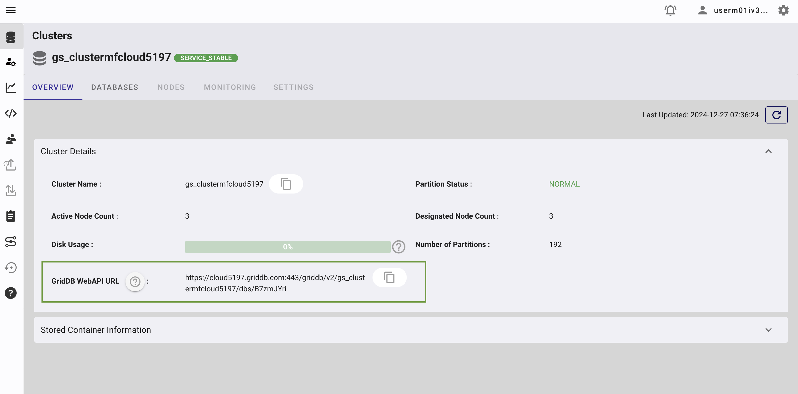

# Create Dynamic Ambient Music Using AI and IoT Data

This tutorial shows how to generate evolving ambient music driven by IoT sensor data. We’ll ingest sensor readings into **GridDB** database, map those readings to musical parameters using OpenAI, and call **ElevenLabs Music** to render an audio track. The UI is built with **React + Vite**, and the backend is **Node.js**.

# Introduction

Ambient music thrives on context. Here, the environment literally composes the score. Heat can slow the tempo, humidity can soften the timbre, and human presence can thicken the arrangement. We’ll stitch together a small system: devices post telemetry (we will use the data directly), GridDB keeps the data, the AI model create music parameters, and ElevenLabs will renders audio that you can play instantly in the browser.

## Prerequisites

### Node.js

This project is built using Next.js, which requires Node.js version 16 or higher. You can download and install Node.js from [https://nodejs.org/en](https://nodejs.org/en).

### GridDB

#### Sign Up for GridDB Cloud Free Plan

If you would like to sign up for a GridDB Cloud Free instance, you can do so at the following link: [https://form.ict-toshiba.jp/download_form_griddb_cloud_freeplan_e](https://form.ict-toshiba.jp/download_form_griddb_cloud_freeplan_e).

After successfully signing up, you will receive a free instance along with the necessary details to access the GridDB Cloud Management GUI, including the **GridDB Cloud Portal URL**, **Contract ID**, **Login**, and **Password**.

#### GridDB WebAPI URL

Go to the GridDB Cloud Portal and copy the WebAPI URL from the **Clusters** section. It should look like this:

#### GridDB Username and Password

Go to the **GridDB Users** section of the GridDB Cloud portal and create or copy the username for `GRIDDB_USERNAME`. The password is set when the user is created for the first time, use this as the `GRIDDB_PASSWORD`.

For more details, to get started with GridDB Cloud, please follow this [quick start guide](https://griddb.net/en/blog/griddb-cloud-quick-start-guide/).

#### IP Whitelist

When running this project, please ensure that the IP address where the project is running is whitelisted. Failure to do so will result in a 403 status code or forbidden access.

You can use a website like [What Is My IP Address](https://whatismyipaddress.com/) to find your public IP address.

To whitelist the IP, go to the GridDB Cloud Admin and navigate to the **Network Access** menu.

### ElevenLabs

You need an ElevenLabs account and API key to use this project. You can sign up for an account at [https://elevenlabs.io/signup](https://elevenlabs.io/signup).

After signing up, go to the **Account** section, and create and copy your API key.

